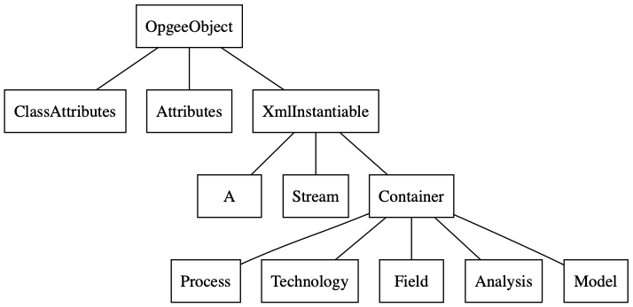

OPGEE Core Classes
============================

The OPGEE core classes are implemented in several Python modules, described below,
and illustrated in the following figure.

``opgee.core``
----------------

This module contains core classes of the opgee package.

.. automodule:: opgee.core
   :members:

``opgee.analysis``
--------------------

.. automodule:: opgee.analysis
   :members:

``opgee.attributes``
----------------------

.. automodule:: opgee.attributes
   :members:

``opgee.container``
----------------------

.. automodule:: opgee.container
   :members:

``opgee.emissions``
----------------------

.. automodule:: opgee.emissions
   :members:

``opgee.energy``
----------------------

.. automodule:: opgee.energy
   :members:

``opgee.field``
----------------------

.. automodule:: opgee.field
   :members:

``opgee.graph``
----------------------

.. automodule:: opgee.graph
   :members:

``opgee.model``
----------------------

.. automodule:: opgee.model
   :members:

``opgee.post_processor``
-------------------------

.. automodule:: opgee.post_processor
   :members:

``opgee.process``
----------------------

.. automodule:: opgee.process
   :members:

``opgee.stream``
----------------------

.. automodule:: opgee.stream
   :members:

``opgee.table_manager``
-------------------------

.. automodule:: opgee.table_manager
   :members:

``opgee.table_update``
-------------------------

.. automodule:: opgee.table_update
   :members:
